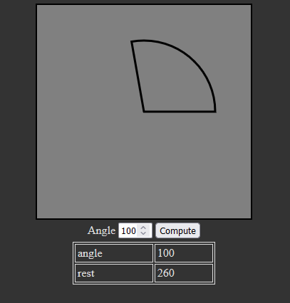

# Arc in canvas

To run locally, open the `index.html` file in your browser.



In this simple project you will learn: 
* arc method in canvas
* getting value in proper type from input 
* using querySelector
* adding event listener
* working with data from object
* creating a simple table using JS

## Code explanation:

* HTML input returns value as a string. You can use `+` sign to convert a value to a number:
```
document.querySelector('#angle').value // "45"

+document.querySelector('#angle').value // 45 
```

* There are `min` and `max` attributes for input, but the user can still type manually invalid values like -5 or 700. In `drawCircle` function we have: 
```
if (angle < 1 || angle > 360) return;
```
When `(angle < 1 || angle > 360)` statement is true, execution of the function is stopped - circle will not be drawn.

* Last parameter in `arc` method:
```
arc(x, y, radius, startAngle, endAngle, counterclockwise)
```
This argument is optional - we use `true` to get [positive angle](https://www.mathsisfun.com/angles.html): arm moves up.

* Logical OR 
```
(360 - angle) || 360

angle = 90;
270 || 360 // 270

angle = 360;
0 || 360 // 0 is converted to false, so we get 360
```

* Creating a table with JS
```
table.innerHTML += `<tr><td>${i}</td><td>${obj[i]}</td></tr>`
```
In this line we create table cells, print the values and keys from the object, and add everything to the table.

* Backtics and dollar sign (Template literals)
```
const name = 'John Doe';

// we can use:
alert(`Hello ${name}`!)

// instead of:
alert("Hello " + name + "!")
```

---------------------
These MDN articles will be useful:
* [Arc method](https://developer.mozilla.org/en-US/docs/Web/API/CanvasRenderingContext2D/arc)
* [Unary plus](https://developer.mozilla.org/en-US/docs/Web/JavaScript/Reference/Operators/Unary_plus)
* [Logical OR](https://developer.mozilla.org/en-US/docs/Web/JavaScript/Reference/Operators/Logical_OR)
* [Template literals](https://developer.mozilla.org/en-US/docs/Web/JavaScript/Reference/Template_literals)
--------------------

Created by: [Piotr Dzoć](https://github.com/Pdzoc)